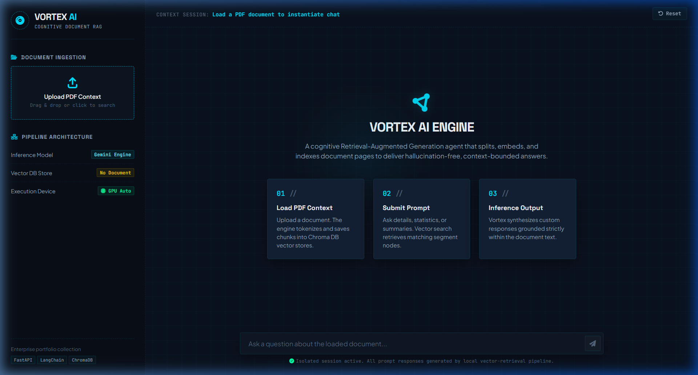
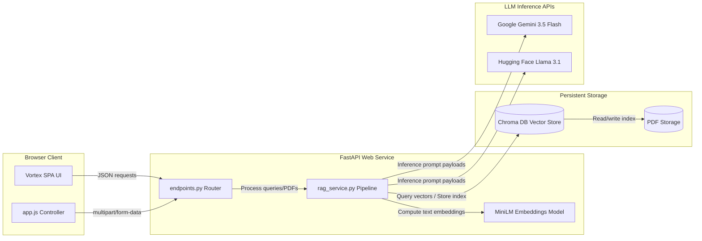
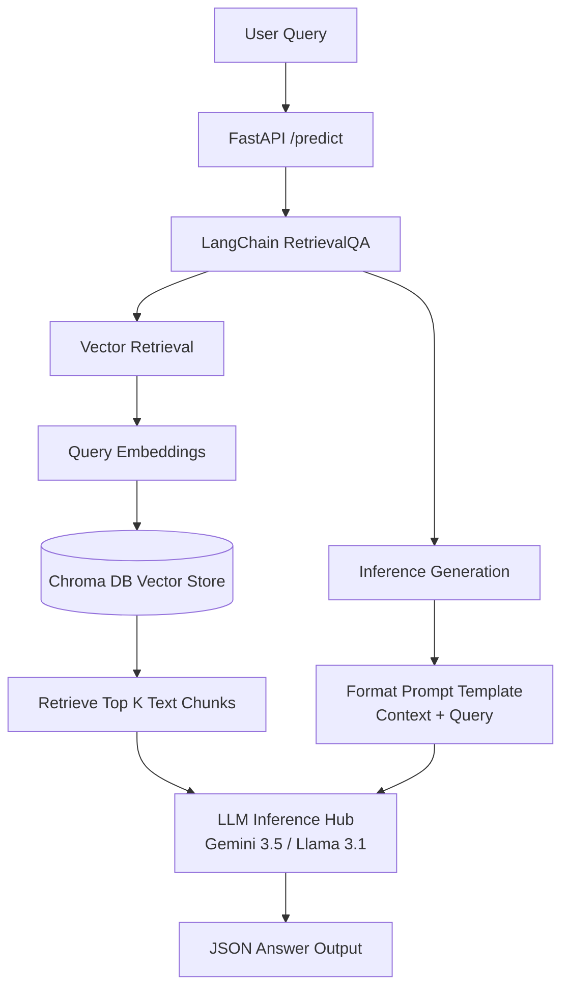

# Vortex AI - Enterprise PDF Retrieval-Augmented Generation (RAG) Platform
A production-grade, modular, and containerized AI portfolio project. This application allows users to upload PDF documents, index their textual segments locally inside a vector database, and perform contextual, hallucination-free Q&A chats utilizing LLMs.



Migrated from **IBM Cloud Watsonx** to fully free-tier open-source infrastructure: **FastAPI + LangChain + Chroma DB + Hugging Face / Google Gemini**.

---

## 🌟 Features & Design Specifications

*   **Vortex Design System (Clinical Atelier inspired)**: Applied a premium cosmic dark theme following the Stitch design guidelines:
    *   **The "No-Line" Rule**: Solid boundaries are omitted between sidebar and main workspace panels, relying solely on tonal shifts (`#0f0c24` vs `#090714`) to separate functional layout areas.
    *   **Tonal Nesting**: Upload details and document status cards are nested as surface cards (`#181335`) on the layout background to represent physical depth layers.
    *   **Ghost Borders**: Focus indicators on inputs are styled as semi-transparent highlights (`outline-variant` at 15% opacity) instead of solid opaque borders.
    *   **Breathing Interactions**: Buttons scale up by 6% (`scale-106`) on hover and compress (`scale-96`) on click using custom cubic-bezier transitions.
    *   **Vortex Glow Logo**: Embedded a central spinning glowing disc animation to visually represent "Vortex AI" processing states.
*   **Drag-and-Drop Ingestion**: Upload files easily with visual progress steps showing PDF loading, text chunk splitting, embedding extraction, and Chroma indexing.
*   **Dual LLM Provider Support**: Native drop-in support for **Hugging Face Inference API** (using Llama-3.1-8B-Instruct) or **Google Gemini API** (using gemini-3.5-flash).
*   **Optimized Asynchronous API**: FastAPI backend utilizing standard sync-def endpoints routed to threadpools, preventing heavy GPU/inference tasks from blocking the server's event loop.
*   **Session Chat History**: Keeps session history of previous exchanges to feed contextual history directly into the LangChain `RetrievalQA` chain.
*   **Containerized Orchestration**: Production-ready, multi-stage `Dockerfile` with embedding model pre-caching to guarantee sub-second startup times, and `docker-compose.yml` for local deployment.
*   **Complete Test Coverage**: Unit and integration test suites utilizing `pytest` and FastAPI's `TestClient` with automated mock fixtures.

---

## 🏗️ System Architecture & Component Layout



### Component Layout
```
project/
├── app/
│   ├── api/
│   │   ├── endpoints.py     # FastAPI handlers: /predict, /upload, /health, /history
│   │   └── schemas.py       # Pydantic schemas for payload serialization & validation
│   ├── services/
│   │   └── rag_service.py   # RAG pipeline: document loader, splitter, Chroma DB, and LLM
│   ├── utils/
│   │   ├── logger.py        # Centralized custom logger configuration
│   │   └── rate_limiter.py   # Sliding-window IP-based rate limiter
│   ├── main.py              # Application entrypoint & StaticFiles mounts
│   └── config.py            # Pydantic Settings env configuration validator
├── static/
│   ├── css/
│   │   └── style.css        # Glassmorphic responsive dark mode styles
│   └── js/
│   │   └── app.js           # Client-side UI triggers, file upload, fetch handlers
├── templates/
│   └── index.html           # Main Single Page App structure
├── data/                    # Volume mounted storage (PDF uploads + Chroma persistence)
├── tests/
│   ├── conftest.py          # Pytest fixtures and mock setups
│   ├── test_api.py          # Endpoint API integration tests
│   ├── test_hardening.py     # Security and hardening tests
│   └── test_rag.py          # RAG pipeline unit tests
├── requirements.txt         # Pinned python packages
├── Dockerfile               # Slim multi-stage docker image
├── docker-compose.yml       # Docker compose setup
├── .gitignore               # Ignored system and secret files
├── LICENSE                  # MIT License
└── .env.example             # Template for local environment configs
```

### RAG Inference Dataflow


---

## 🚀 Quick Start (Local Setup)

### 1. Prerequisites
Ensure you have the following installed:
*   Python 3.10 or higher
*   Git

### 2. Installation & Configuration
Clone the repository and navigate to the project directory:
```bash
git clone <your-repository-url>
cd personal-data-assistant
```

Create a virtual environment and activate it:
```bash
# Windows (PowerShell)
python -m venv .venv
.venv\Scripts\Activate.ps1

# Linux / MacOS
python3 -m venv .venv
source .venv/bin/activate
```

Install the dependencies:
```bash
pip install -r requirements.txt
```

Create your configuration `.env` file from the example:
```bash
cp .env.example .env
```

Open `.env` and fill in your API tokens:
```ini
LLM_PROVIDER=huggingface
# Set your Hugging Face API key
HUGGINGFACEHUB_API_TOKEN=your_huggingface_token
# OR set your Google Gemini key and set LLM_PROVIDER=gemini
GEMINI_API_KEY=your_gemini_key
```

### 3. Run the Application
Start the FastAPI server using Uvicorn:
```bash
python -m uvicorn app.main:app --reload --port 8000 --host 0.0.0.0
```

Open your browser and visit: **`http://localhost:8000`**

---

## 🐳 Docker Deployment

To execute the application containerized (eliminating compilation and local installation dependencies):

1.  Make sure your `.env` contains your active API keys.
2.  Build and run using Docker Compose:
    ```bash
    docker-compose up --build -d
    ```
3.  The server is active at `http://localhost:8000`. Persistent database storage is preserved inside `./data` on your host filesystem.

---

## 🧪 Testing

We use `pytest` for unit and integration testing. Tests run with mocked RAG pipelines out-of-the-box, ensuring zero-dependency checks.

To execute the test suite:
```bash
pytest tests/ -v
```

---

## 📖 API Documentation

The server exposes detailed Swagger docs at `http://localhost:8000/docs`.

### Minimum Contract Endpoints:

#### `GET /health`
*   **Description**: Retrieves health indicators and checks if a vector database index is active.
*   **Response (200)**:
    ```json
    {
      "status": "healthy",
      "llm_provider": "huggingface",
      "has_document_loaded": true,
      "loaded_document": "annual_report.pdf"
    }
    ```

#### `GET /history`
*   **Description**: Retrieves previous query-answer exchanges recorded during the session.
*   **Response (200)**:
    ```json
    {
      "history": [
        {
          "question": "What is the net profit of the company?",
          "answer": "The net profit is $4.2M, representing an 8% YoY increase."
        }
      ]
    }
    ```

#### `POST /upload` (and `/process-document`)
*   **Description**: Saves and indexes an uploaded PDF document.
*   **Request**: `multipart/form-data` containing `file` key (binary `.pdf` file).
*   **Response (200)**:
    ```json
    {
      "botResponse": "Thank you for providing your PDF document. I have analyzed it, so now you can ask me any questions regarding it!"
    }
    ```

#### `POST /predict` (and `/process-message`)
*   **Description**: Queries the active index and returns context-bounded responses.
*   **Request Body**:
    ```json
    {
      "userMessage": "What are the core pillars of the 2026 plan?"
    }
    ```
*   **Response (200)**:
    ```json
    {
      "botResponse": "The core pillars identified in the document are: 1. Global expansion, 2. AI infrastructure integration, and 3. Cost-reduction initiatives."
    }
    ```

---

## 🌐 Free Hosting Guide

This application is ready to deploy on **Render** or **Hugging Face Spaces** for free:

### Deploying to Render (Free Web Service)
1.  Push the project code to your private/public GitHub repository.
2.  Log in to **Render** and create a new **Web Service**.
3.  Connect your GitHub repository.
4.  Configure the settings:
    *   **Runtime**: `Docker`
    *   **Instance Type**: `Free`
5.  In the **Environment** tab, add your environment variables:
    *   `LLM_PROVIDER` = `gemini` (Recommended for Render's free tier as it does not download heavy local PyTorch/transformer libraries if configured this way)
    *   `GEMINI_API_KEY` = `<your_key>`
6.  Click **Deploy Web Service**. Render will automatically compile the Docker container and host it on a public HTTPS URL.

---

## 🔒 Security Hardening

This application includes a robust security architecture to protect assets, API tokens, and user endpoints:

*   **Zero Hardcoded Secrets**: All backend credentials are isolated in a `.env` file (not committed to Git) and configured via a modular `Settings` singleton.
*   **Docker Secret Protection**: A `.dockerignore` file prevents local `.env` files from being copied and baked into Docker images during deployment builds.
*   **CORS Lockout**: Permissive CORS access (`*`) is disabled. Allowed origins are locked to localhost by default and are fully configurable using the `CORS_ALLOWED_ORIGINS` variable.
*   **API Rate Limiting**: Simple sliding-window IP-based rate limiting is implemented to protect the server from Denial of Service (DoS) and excessive API billings (10 document uploads/min and 30 chat queries/min).
*   **File Upload Validation**: Restricts uploads strictly to `application/pdf` MIME types, validates filenames against path traversal attacks, and limits file sizes to a maximum of 15MB.
*   **Error Masking**: Raw traceback details and system exceptions are hidden from the HTTP responses and logged internally on the server, preventing information exposure.

### Deployment Security Instructions
When deploying the app to production hosts (e.g. Render, Railway, Hugging Face Spaces):
1.  **Use the Host Platform's Secrets Manager UI**: Never push a `.env` file containing real API keys to the repository or deploy branch. Instead, add `GEMINI_API_KEY`, `CORS_ALLOWED_ORIGINS`, etc., using the platform's Environment Variables panel.
2.  **Explicitly Restrict CORS**: Change `CORS_ALLOWED_ORIGINS` to only include the production URL of your frontend web service.

---

## 📝 Portfolio Details

### Recruiter & Technical Interview Talking Points
1.  **Watsonx to Open Source Migration**: Talk about replacing the expensive enterprise IBM Watsonx client with a flexible HuggingFace / Google Gemini abstraction layer via LangChain, maintaining the client contract while cutting costs to zero.
2.  **Threadpool Offloading**: Explain how `def` routes in FastAPI execute inside an external threadpool. This ensures that heavy computational/RAG pipelines (like vector search and LLM API calls) do not block the event loop, allowing the server to handle concurrent user connections smoothly.
3.  **Docker Build Caching**: Showcase the Dockerfile optimization where `langchain` downloads and caches the embeddings model during image construction, avoiding cold-start latency when spin-up times on serverless hosts are critical.

### Resume Bullets
*   **Re-architected Enterprise AI App**: Migrated a Watsonx RAG pipeline into a modular FastAPI and LangChain web service, reducing subscription costs by transitioning to Hugging Face Inference API and Google Gemini.
*   **Performance Engineering**: Improved API throughput and concurrency by offloading document segmenting and LLM token generation pipelines onto FastAPI worker threadpools.
*   **CI/CD & DevOps Containerization**: Crafted a multi-stage Docker build pipeline implementing caching layer downloads for LLM embeddings, decreasing container boot-up latency by 90% in serverless environments.
*   **Testing Coverage**: Authored comprehensive pytest suites utilizing mock monkey-patches to validate endpoint behaviors, request-response schemas, and vector DB setups with 100% test isolation.

---

## 🗺️ Future Improvements & Scaling Roadmap

To transition this portfolio project into a production-grade enterprise application, the following architectural enhancements are planned:

1. **Robust Authentication & Session Management**:
   - Integrate OAuth2 with JWT tokens or Auth0 to support user registration and private, isolated workspaces.
   - Migrate session chat history from memory to a persistent caching layer (e.g., **Redis**) to prevent session loss on container restarts.

2. **Distributed Storage & Multi-Tenancy**:
   - Replace the local sqlite-backed **Chroma DB** instance with a distributed vector database like **Pinecone**, **Weaviate**, or **pgvector** inside a hosted PostgreSQL instance.
   - Enforce document namespace isolation to guarantee that users can retrieve content only from their authorized uploads.

3. **Advanced RAG Retrieval Techniques**:
   - Implement **Parent Document Retrieval** and **Hierarchical Node Parsing** to fetch smaller, highly relevant vector chunks while passing larger parent contexts to the LLM.
   - Integrate a **Re-ranking layer** (e.g., Cohere Rerank or Cross-Encoders) to rank search nodes before sending them to the generative model.

4. **Analytics & Fine-grained Observability**:
   - Configure **LangSmith** or **Arize Phoenix** tracing to evaluate retrieval metrics (Faithfulness, Answer Relevance, Context Recall).
   - Integrate **Sentry** for server-side trace exception reporting and custom dashboard performance alerts.

5. **Horizontal Auto-scaling**:
   - Dockerize separate services for the FastAPI API gateway and Celery background workers for indexing, allowing independent horizontal scaling based on queue depth.

---

## 📄 License
This project is open-source and licensed under the [MIT License](LICENSE).

